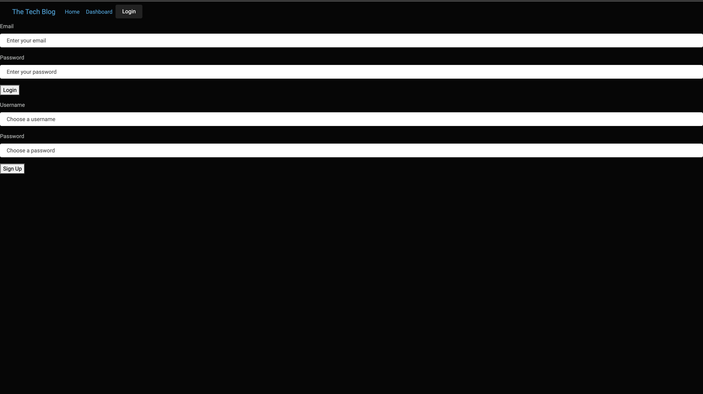

  # Tech-Blog
  ## Description
  This tech blog is for developers to publish their blog posts and comment on other developers’ posts as well. It's a hub to centralize information on development as well as create a space for interaction. Users can have their own account where they can view their own blogs that they have created and as well as a view where they can vieww all blogs contributed by others users. 
  ## Table of Contents
  - [Installation](#installation)
  - [Screenshots](#screenshots)
  - [Questions](#questions)
  
  ## Installation
  To install the application, follow these steps:

  1. Clone the repository to your local machine.
  2. Navigate to the project directory.
  3. Run npm install to install the required dependencies.

  ## Screenshots
  
  

  ## Questions

  If you have questions about this application, my contact information is below. 

  Github Account: [cameronfrench](https://github.com/cameronfrench)
  
  Email Address: [cameron.french92@gmail.com](mailto:cameron.french92@gmail.com)
  
  